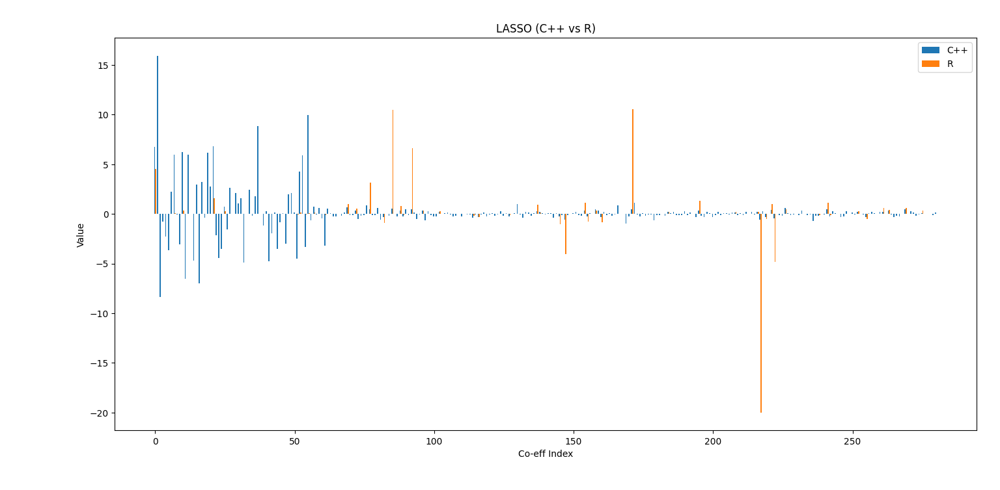
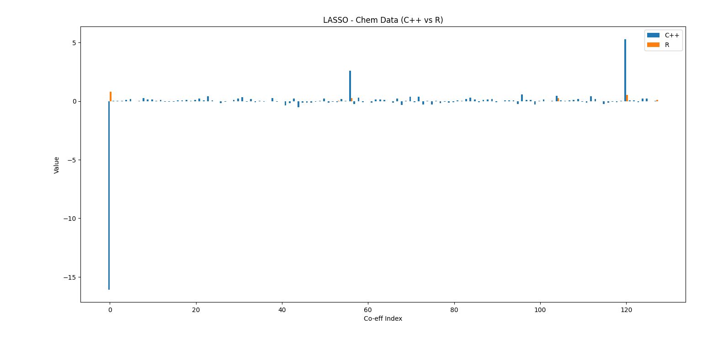

### Requirements to Run `lasso_test.cpp`
- `regression_metrics.hpp`
- `Eigen`
- `header_lasso.cpp`
- `lasso.cpp`
- `OpenMP` -> For Parallelisation.

### Compiler Flags
```
g++ -I . lasso_test.cpp -o lasso.exe -O3 -fopenmp -fno-math-errno
```

### Results

1. Blog Data Dataset


2. Chem Dataset
